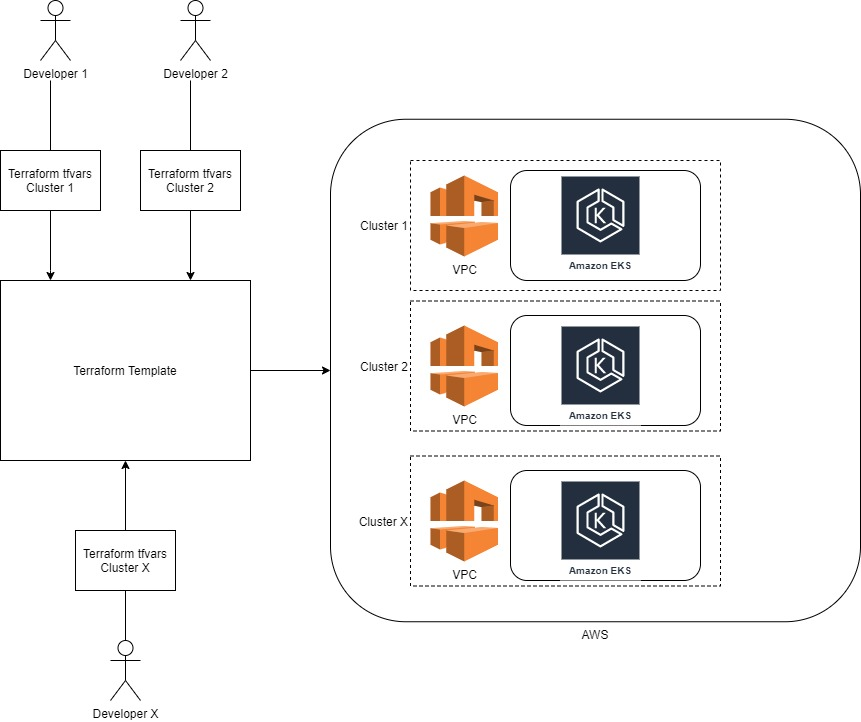
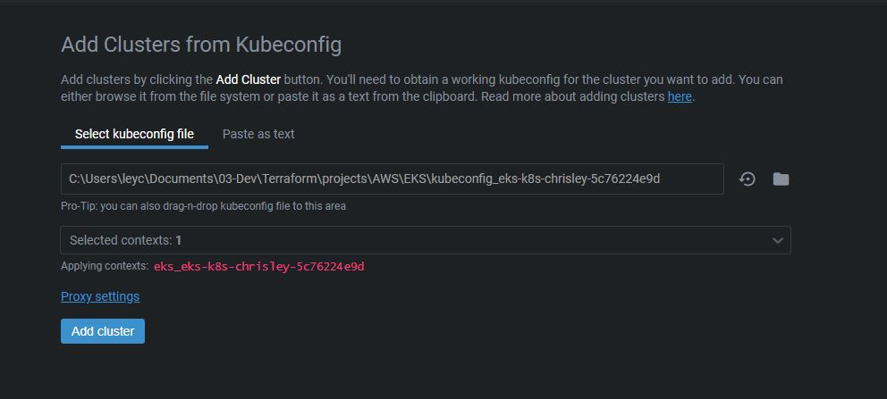
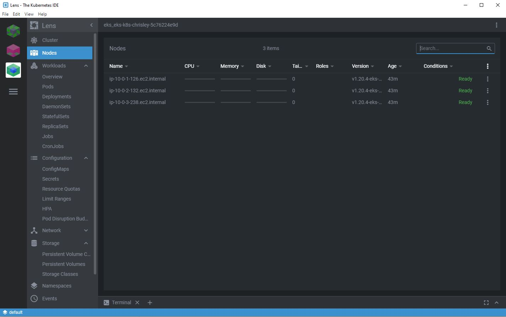

# Deploy and Manage Kubernetes Cluster in AWS - EKS Cluster

Amazon Elastic Kubernetes Service (Amazon EKS) gives you the flexibility to start, run, and scale Kubernetes applications in the AWS cloud.

## Prerequisites

##### Mandatory:
- AWS account with the following IAM permissions :  
- [Terraform](https://www.terraform.io/downloads.html) ~> 0.14
- [AWS CLI v2](https://docs.aws.amazon.com/cli/latest/userguide/install-cliv2-windows.html#cliv2-windows-install) ~> 2.0

##### Optional but recommended:
- [kubectl](https://kubernetes.io/docs/tasks/tools/)
- wget (required for the eks module)


## HLD - Terraform template and tfvars to manage AWS EKS Cluster



## Usage

##### Create a Terraform variable (.tfvars) file containing the following parameters

```bash
$ vim my.tfvars
```

```config
## AWS params and creds
AWS_ACCESS_KEY_ID="<AWS_ACCESS_KEY>"
AWS_SECRET_ACCESS_KEY="<AWS_SECRET_ACCESS_KEY>"
# AWS Region to use, by default "eu-west-3"
AWS_REGION="<AWS_REGION>"

## Cluster params
# Master Name is the name that will be used to prefix all AWS Component (VPC,  to setup your deployment
MASTER_NAME="<MASTER_NAME>"
# Kubernetes version to use, by default "1.20"
K8s_VERSION="<Kubernetes_Version>"
# Type of EC2 instance to use for Worker node
INSTANCE_TYPE="t3.medium"
# MINIMUM WORKER NODE
MIN_WORKER_NODE="3"
# MAXIMUM WORKER NODE
MAX_WORKER_NODE="3"
# DESIRED WORKER NODE
DESIRED_WORKER_NODE="3"
```

## Deploy & Manage

Use Terraform to deploy EKS Cluster

##### Init and download Terraform plugin and Module

```bash
$ terraform init
```

##### Plan the deployment and visualize what will be deployed and the changes
```bash
$ terraform plan -var-file="<tfvars file>"
```

##### Apply the deployment
```bash
$ terraform apply -var-file="<tfvars file>"
```

##### Destroy the deployment
```bash
$ terraform destroy -var-file="<tfvars file>"
```

## Troubleshooting the deployment

> Sometimes, depending on the size of the deployed cluster (type of instance, number of nodes defined in the parameters of the EKS cluster), it is possible that the terraform apply falls in error after reaching the timeout. Don't panic, just restart the terraform apply.

##### Example of errors
```bash
│ Error: Error making request: Get "https://BD627AEA2C596BA986969096F8594EC7.gr7.us-east-1.eks.amazonaws.com/healthz": EOF
│
│   with module.eks.data.http.wait_for_cluster[0],
│   on .terraform\modules\eks\cluster.tf line 68, in data "http" "wait_for_cluster":
│   68: data "http" "wait_for_cluster" {
```

##### Re Apply the deployment
```bash
$ terraform apply -var-file="<tfvars file>"
```

## Connect to EKS Cluster
##### Show the clusters in AWS

```bash
chris@toolbox-chris:~/certs$ aws eks list-clusters --region us-east-1
{
    "clusters": [
        "eks-k8s-chrisley-5c76224e9d"
    ]
}
```

##### Update kubeconfig

```bash
chris@toolbox-chris:~/certs$ aws eks --region us-east-1 update-kubeconfig --name eks-k8s-chrisley-5c76224e9d
```

##### Check the new EKS Cluster context is well set and active in kubeconfig (the one with "*" is active)

```bash
chris@toolbox-chris:~/certs$ kubectl config get-contexts
CURRENT   NAME                                                                     CLUSTER                                                                  AUTHINFO                                                                 NAMESPACE
*         arn:aws:eks:us-east-1:005915627013:cluster/eks-k8s-chrisley-5c76224e9d   arn:aws:eks:us-east-1:005915627013:cluster/eks-k8s-chrisley-5c76224e9d   arn:aws:eks:us-east-1:005915627013:cluster/eks-k8s-chrisley-5c76224e9d
          chris-k8s-01                                                             chris-k8s-01                                                             chris-k8s-01
          chris-k8s-01-worker1-rancher                                             chris-k8s-01-worker1-rancher                                             chris-k8s-01

```


> Your cluster is now ready and available. You can deploy applications with kubectl, helm, etc....

## Optional - Use Lens IDE to manage your cluster

##### Download and install LENS Kubernetes IDE
[LENS](https://k8slens.dev/)

##### Setup your cluster in LENS


##### Manage your cluster with LENS


